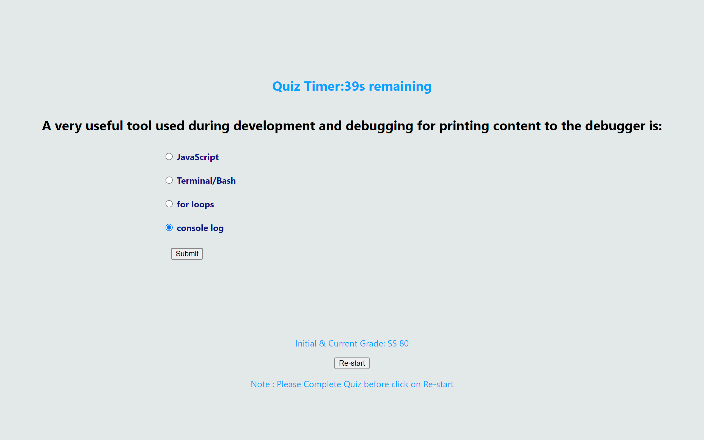

#C Challenge-4-Coding-Fundamental-Quiz
# Challenge-4-Coding-Fundamental-Quiz
## Link to application 
https://seanye333.github.io/Challenge-4-Coding-Fundamental-Quiz/

## Description
This repository contains the code for a quiz with five questions and four choices on each question More features and sequences are described below. 

The code includes Javascript, HTML and CSS files necessary to create a quiz for user to test their fundamentals on basic coding concepts . The sequence of operation is described below: 
 1. create an array with all questions and write to HTML
 2. declar and point variables to HTML
 3. create quiz start pushbutton to allow user to start and hide the start window 
 4. create countdowm timer for quiz 
 5. verify answer with each questions 
 6. substract 10s if response is incorrect 
 7. hide question window if questions are all answered 
 8. display a box with submit function to allow users input their initials
 9. hide user' initals window 
 10. calculate and display grade of quiz with initials
 11. store user's score 
 12. click on Re-start pushbutton to jump back to step 4 and restart timer once start button is clicked 

From this assignment: I learned how to apply if statement, functions, and var, timer, event listner, store data,  etc. to the code. 

## Installation
To install this project within your computer, please follow the instruction below
1. Open git bash
2. Create your own file
3. To clone the repository: type in git clone https://github.com/Seanye333/Challenge-4-Coding-Fundamental-Quiz
4. Navigate to the project directory: cd <project_directory>
5. Open the file in the web browser: open index.html
6. Website will display on your default browser

## Usage
Please open the HTML file (index.html) in a web browser to view the homepage. The CSS file (style.css) and javascript file are referenced in the HTML file and automatically applied to the webpage in the web browser. The website will be deployed for all users to use by simply copy and paste to browser.

 
## Credits
To understand how to randomly generate passwords , mdn web was utilized to learn the concepts: 
https://developer.mozilla.org/en-US/docs/Web/HTML/Element/input/submit 
https://developer.mozilla.org/en-US/docs/Web/API/EventTarget/addEventListener

## License
This project is licensed under the MIT License.

## Features
Following features are from original acceptance criteria from the project: 

    GIVEN I am taking a code quiz
    WHEN I click the start button
    THEN a timer starts and I am presented with a question
    WHEN I answer a question
    THEN I am presented with another question
    WHEN I answer a question incorrectly
    THEN time is subtracted from the clock
    WHEN all questions are answered or the timer reaches 0
    THEN the game is over
    WHEN the game is over
    THEN I can save my initials and my score

## How to Contribute
Contributions to this project are not avaiable currently.
